# TADPODS Product and System Design

**Status:** Draft for owner review before implementation planning  
**Date:** 5 August 2026  
**Repository:** `dylmarriner/tadpods`

## 1. Executive Summary

TADPODS is a narrow business-management system for inventory, purchasing, sales, customer accounts, supplier accounts, invoices, payments, deliveries, backorders, statements, and operational reporting.

It deliberately does not attempt to become a general-purpose ERP or full accounting package. Its job is to make the daily flow from order to stock movement to invoice to payment obvious, safe, and fast.

The product should feel:

- simpler than ERPNext;
- as readable as Xero for customer and supplier account activity;
- as operationally useful as Cin7 for stock, purchasing, fulfilment, and backorders;
- consistently branded as TADPODS;
- usable by staff who are not accountants.

The design uses a modular monolith rather than microservices. That gives TADPODS clear internal boundaries and production-grade transactional safety without creating a distributed-systems hobby project nobody asked for.

## 2. Product Boundary

### 2.1 In scope

- Customers and customer accounts
- Suppliers and supplier accounts
- Products and supplier-product relationships
- Warehouses
- Stock on hand and stock movements
- Stock reservations
- Purchase orders
- Goods receipts
- Supplier bills and payments
- Sales orders
- Deliveries
- Backorders
- Customer invoices and payments
- Customer and supplier credits
- Statements
- Aged receivables and payables
- Tax summaries and exports
- Role-based access control
- Audit history
- TADPODS-branded emails, PDFs, reports, and notifications

### 2.2 Explicitly out of scope for the first production release

- General ledger
- Full double-entry bookkeeping interface
- Payroll
- Fixed assets
- Manufacturing and bills of materials
- Human resources
- CRM campaigns
- Project management
- Point of sale
- E-commerce storefront
- Multi-company consolidation
- Automated bank reconciliation
- Complex landed-cost allocation
- Advanced demand forecasting
- Native mobile applications

TADPODS may later export transactions to Xero or another accounting system, but it will not reproduce an entire accounting suite inside the product.

## 3. Explicit Assumptions

1. The first deployment is for one legal business entity.
2. The default currency is NZD.
3. The default tax model is New Zealand GST, while tax rates remain configurable.
4. Money is stored as fixed-precision decimal values, never binary floating point.
5. Quantities support decimals for products sold by weight or length.
6. Posted financial and stock records are immutable.
7. Corrections use explicit reversal records rather than editing history.
8. A confirmed purchase order is a commitment, not a supplier-account liability.
9. Goods received but not billed are tracked separately from posted supplier bills.
10. Customer payments and supplier payments belong to accounts, not directly to invoices or bills.
11. Allocation records connect payments to invoices or bills.
12. Automatic payment allocation uses oldest-due-date first, then document date, then document number.
13. A backorder is generated from a confirmed sales-order shortage, not represented as a duplicate sales order.
14. A stock movement is the authoritative source of stock on hand.
15. Cached totals may exist for performance, but must be reproducible from authoritative ledgers.
16. Negative stock is disabled by default and can only be enabled by a privileged administrator.
17. The uploaded RELX image is not a TADPODS logo or reusable brand asset. It contains a third-party mark and product silhouette. It may be treated only as a monochrome visual mood reference.
18. English is the initial interface language.
19. The product will be desktop-first, tablet-friendly, and usable on mobile for common lookups and approvals.
20. The initial architecture is self-hostable with Docker Compose and deployable to a conventional Linux server.

## 4. Product Principles

### 4.1 One obvious next action

Every major record page must show:

- current status;
- completed steps;
- outstanding work;
- warnings;
- one recommended next action;
- secondary actions grouped separately.

Examples:

- Confirmed sales order with reserved stock: **Deliver available stock**
- Delivered order not yet invoiced: **Create invoice**
- Partially paid invoice: **Record payment**
- Confirmed purchase order with outstanding quantity: **Receive goods**
- Goods received but not billed: **Create supplier bill**
- Supplier bill due: **Pay supplier**

### 4.2 Plain operational language

Use labels such as:

- Amount outstanding
- Available customer credit
- Amount owed to supplier
- Received but not billed
- Stock available
- Waiting for stock

Avoid presenting bookkeeping terms unless legally or operationally necessary.

### 4.3 Minimal duplicate entry

The system should carry information forward through workflows:

- purchase order to goods receipt;
- goods receipt to supplier bill;
- sales order to delivery;
- delivery or sales order to invoice;
- account to payment entry;
- incoming receipt to backorder allocation.

### 4.4 Safe posting

Drafts can be edited. Posted records cannot.

Posting a record that affects money or stock must:

1. validate the complete command;
2. acquire required database locks;
3. check idempotency;
4. write all related records in one transaction;
5. append audit history;
6. return the completed result only after commit.

## 5. Recommended Technical Architecture

### 5.1 Architecture style

Use a TypeScript modular monolith in a pnpm workspace.

```text
apps/
  web/                 Next.js user interface
  api/                 NestJS API using Fastify
  worker/              PostgreSQL-backed background jobs
packages/
  domain/              Domain types, policies, calculations, state transitions
  database/            Prisma schema, migrations, repositories, transaction helpers
  contracts/           API request/response schemas and generated client types
  ui/                  TADPODS design system and reusable components
  documents/           PDF, email, statement, and remittance templates
  auth/                Authentication and permission policy helpers
  config/              Shared typed configuration
  test-support/        Builders, fixtures, clocks, and integration helpers
```

### 5.2 Technology choices

- Node.js 24 LTS or the current supported production LTS at implementation time
- TypeScript with strict mode enabled
- pnpm workspaces
- Next.js App Router
- NestJS with Fastify
- PostgreSQL 17 or newer supported production version
- Prisma ORM with SQL migrations for database-specific constraints
- PostgreSQL row locks and advisory locks for concurrency protection
- PostgreSQL-backed job queue such as `pg-boss`
- S3-compatible attachment storage
- MinIO for local development
- Mailpit for local email capture
- React Hook Form and Zod for forms and validation
- TanStack Table for dense operational lists
- Vitest for unit and component tests
- Supertest for API integration tests
- Playwright for end-to-end workflow tests
- Docker Compose for local development and simple self-hosted deployment

### 5.3 Why a modular monolith

A microservice architecture would increase deployment complexity, consistency problems, and operational overhead without improving the first version. TADPODS needs strong transactions across orders, stock, invoices, and allocations. Keeping these modules in one database and one API process makes correctness easier to prove.

Modules remain isolated through explicit application services and repository interfaces so they can be separated later if actual scale requires it.

## 6. Delivery Decomposition

The full specification is too large for one implementation plan. It will be delivered as six independently testable subprojects.

### Phase 1: Platform foundation

- Monorepo
- Database foundation
- Authentication
- Users, roles, and permissions
- Audit log
- TADPODS branding system
- Navigation shell
- Global search framework
- Document numbering
- Attachments
- Development environment

### Phase 2: Products and inventory

- Products
- Suppliers linked to products
- Warehouses
- Stock movements
- Opening stock
- Adjustments
- Transfers
- Stock-on-hand views
- Availability calculations
- Barcode support

### Phase 3: Purchasing and supplier accounts

- Purchase orders
- Goods receipts
- Supplier bills
- Supplier payments
- Supplier credits
- Supplier statements
- Received-not-billed
- Aged payables

### Phase 4: Sales, reservations, deliveries, and backorders

- Sales orders
- Stock reservations
- Deliveries
- Partial fulfilment
- Backorders
- Incoming-stock allocation
- Customer notifications

### Phase 5: Customer invoicing and accounts receivable

- Customer invoices
- Customer payments
- Automatic allocations
- Manual allocation
- Credits
- Refunds
- Statements
- Aged receivables
- Installment schedules

### Phase 6: Reporting and production hardening

- Operational dashboard
- Complete report suite
- PDF and spreadsheet exports
- Bank-import workflow
- Email delivery
- Backup and restore documentation
- Deployment hardening
- Performance testing
- Administrator guide
- End-user guide

Each phase must produce runnable software with tests before the next phase begins.

## 7. Navigation and Screen Structure

### 7.1 Primary navigation

The main navigation should contain no more than these top-level sections:

1. Dashboard
2. Sales
3. Purchasing
4. Inventory
5. Customers
6. Suppliers
7. Reports
8. Administration

### 7.2 Sales

- Sales orders
- Deliveries
- Backorders
- Customer invoices
- Customer payments
- Customer credits

### 7.3 Purchasing

- Purchase orders
- Goods receipts
- Supplier bills
- Supplier payments
- Supplier credits

### 7.4 Inventory

- Products
- Stock on hand
- Warehouses
- Stock movements
- Stock transfers
- Reorder recommendations

### 7.5 Customers

- Customer list
- Customer account page
- Statements
- Aged receivables

### 7.6 Suppliers

- Supplier list
- Supplier account page
- Statements
- Aged payables
- Received-not-billed

### 7.7 Record-page layout

Every major document page uses the same structure:

1. Title and document number
2. Status badge
3. Workflow progress bar
4. Primary next-action button
5. Summary figures
6. Main document lines
7. Related records
8. Activity and audit timeline
9. Attachments and notes
10. Secondary action menu

This consistency is not decorative. It is how new staff learn one workflow and then understand the others.

## 8. Primary User Journeys

### 8.1 Sell stocked goods

1. Open **New sales order**.
2. Select or create the customer.
3. Search products by name, SKU, supplier code, or barcode.
4. See stock on hand, available stock, incoming stock, and expected date inline.
5. Enter quantities.
6. Confirm the order.
7. System reserves available stock.
8. System identifies any shortage.
9. User chooses backorder, cancel shortage, or privileged negative-stock override.
10. User selects **Deliver available stock**.
11. Delivery posts stock reductions.
12. User selects **Create invoice**.
13. User sends or downloads the TADPODS invoice.
14. Payment is recorded later in full or installments.

### 8.2 Purchase stock

1. Open a reorder recommendation, backorder, or new purchase order.
2. Select the supplier.
3. Add products and quantities.
4. Confirm the purchase order.
5. Receive all or selected lines.
6. Goods receipt posts stock increases.
7. System suggests backorders that can now be fulfilled.
8. Create or match the supplier bill.
9. Post the supplier bill.
10. Record one or more supplier payments.
11. Send TADPODS remittance advice.

### 8.3 Record a customer payment

1. Start from the customer account, invoice, payment screen, or bank import.
2. Enter amount, date, method, reference, and optional note.
3. Preview automatic oldest-first allocation.
4. Post the payment.
5. System creates allocation records transactionally.
6. Any excess becomes available customer credit.
7. Show allocation summary and updated account balance.

### 8.4 Handle a backorder

1. Confirm a sales order with insufficient available stock.
2. Create a linked backorder for the shortage.
3. Assign priority and customer promise date.
4. Link an existing purchase order or generate a new one.
5. Receive incoming goods.
6. System suggests allocation to eligible backorders.
7. Allocate stock according to configured policy.
8. Notify the user that the backorder is ready.
9. Deliver the remaining quantity from the original sales order.

## 9. Domain Model

### 9.1 Core entities

The required entities remain the foundation:

- `customers`
- `customer_addresses`
- `suppliers`
- `supplier_addresses`
- `products`
- `product_suppliers`
- `warehouses`
- `stock_movements`
- `stock_reservations`
- `sales_orders`
- `sales_order_lines`
- `deliveries`
- `delivery_lines`
- `backorders`
- `backorder_lines`
- `purchase_orders`
- `purchase_order_lines`
- `goods_receipts`
- `goods_receipt_lines`
- `customer_invoices`
- `customer_invoice_lines`
- `customer_payments`
- `customer_payment_allocations`
- `customer_credits`
- `supplier_bills`
- `supplier_bill_lines`
- `supplier_payments`
- `supplier_payment_allocations`
- `supplier_credits`
- `tax_rates`
- `document_sequences`
- `attachments`
- `users`
- `roles`
- `audit_logs`

### 9.2 Required supporting entities

These additions are required for correctness rather than feature decoration:

- `role_permissions`
- `user_roles`
- `payment_allocation_reversals`
- `supplier_payment_allocation_reversals`
- `customer_credit_applications`
- `supplier_credit_applications`
- `customer_refunds`
- `supplier_refunds`
- `installment_schedules`
- `installment_schedule_lines`
- `stock_reservation_events`
- `backorder_allocations`
- `document_links`
- `idempotency_keys`
- `outbox_events`
- `email_deliveries`
- `report_exports`
- `brand_settings`
- `system_settings`

### 9.3 Common record fields

Business records should include, where applicable:

- `id` as UUID
- human-readable document number
- status
- version number for optimistic concurrency
- created timestamp and user
- updated timestamp and user
- posted timestamp and user
- voided timestamp and user
- reversal record reference
- notes
- source or import reference
- idempotency key

### 9.4 Entity relationship model

```mermaid
erDiagram
    customers ||--o{ customer_addresses : has
    customers ||--o{ sales_orders : places
    customers ||--o{ customer_invoices : receives
    customers ||--o{ customer_payments : pays
    customers ||--o{ customer_credits : owns

    suppliers ||--o{ supplier_addresses : has
    suppliers ||--o{ product_suppliers : supplies
    suppliers ||--o{ purchase_orders : receives
    suppliers ||--o{ supplier_bills : issues
    suppliers ||--o{ supplier_payments : receives
    suppliers ||--o{ supplier_credits : owns

    products ||--o{ product_suppliers : has
    products ||--o{ stock_movements : moves
    products ||--o{ stock_reservations : reserves
    warehouses ||--o{ stock_movements : contains
    warehouses ||--o{ stock_reservations : contains

    sales_orders ||--|{ sales_order_lines : contains
    sales_orders ||--o{ deliveries : fulfilled_by
    deliveries ||--|{ delivery_lines : contains
    sales_orders ||--o{ backorders : creates
    backorders ||--|{ backorder_lines : contains
    sales_orders ||--o{ customer_invoices : invoiced_by

    purchase_orders ||--|{ purchase_order_lines : contains
    purchase_orders ||--o{ goods_receipts : received_by
    goods_receipts ||--|{ goods_receipt_lines : contains
    purchase_orders ||--o{ supplier_bills : billed_by

    customer_invoices ||--|{ customer_invoice_lines : contains
    customer_payments ||--o{ customer_payment_allocations : allocates
    customer_invoices ||--o{ customer_payment_allocations : receives

    supplier_bills ||--|{ supplier_bill_lines : contains
    supplier_payments ||--o{ supplier_payment_allocations : allocates
    supplier_bills ||--o{ supplier_payment_allocations : receives
```



## 10. Document and Status Design

### 10.1 Separate status dimensions

Sales orders must not use one overloaded status field to represent fulfilment, invoicing, and payment. Store separate dimensions:

- lifecycle status: draft, confirmed, cancelled, closed;
- allocation status: none, partial, allocated;
- fulfilment status: not delivered, partial, delivered;
- backorder status: none, open, partial, fulfilled, cancelled;
- invoicing status: not invoiced, partial, invoiced;
- payment status: unpaid, partial, paid, overdue, credited.

A display status may be derived for lists, but the underlying dimensions remain separate.

Purchase orders use the same principle:

- lifecycle status;
- receipt status;
- billing status;
- payment status.

### 10.2 Human-readable progress

Sales display:

`Draft → Confirmed → Allocated → Delivered → Invoiced → Paid`

Purchase display:

`Draft → Confirmed → Received → Billed → Paid`

Partial stages must remain visible rather than silently skipping to a misleading final badge.

## 11. Customer Payment Allocation Design

### 11.1 Authoritative records

- `customer_payments` stores the full payment received.
- `customer_payment_allocations` stores amounts applied to invoices.
- `customer_credits` stores unused account-level value.
- reversal tables preserve allocation changes without deleting history.

### 11.2 Eligible invoices

An invoice is eligible when:

- it belongs to the same customer;
- it is posted;
- it is not voided;
- it has a positive outstanding balance;
- its currency matches the payment currency;
- it is not under a blocking dispute rule configured by the business.

### 11.3 Sort order

Automatic allocation sorts by:

1. due date ascending;
2. invoice date ascending;
3. document number ascending;
4. UUID as a final deterministic tie-breaker.

### 11.4 Posting algorithm

Within one serializable or carefully locked database transaction:

1. Lock the customer account allocation key.
2. Verify the idempotency key is unused.
3. Insert the payment.
4. Lock eligible invoice rows in allocation order.
5. Calculate each invoice outstanding amount from posted totals and active allocations.
6. Allocate the lesser of remaining payment and invoice outstanding amount.
7. Insert immutable allocation rows.
8. Continue until the payment is exhausted or invoices are cleared.
9. Insert customer credit for any unused amount.
10. Recalculate derived invoice statuses.
11. Append audit events and outbox events.
12. Commit.

### 11.5 Invariants

Database and application constraints must enforce:

- allocation amount is greater than zero;
- active allocations do not exceed payment amount;
- active allocations do not exceed invoice outstanding amount;
- payment and invoice belong to the same customer;
- payment and invoice use the same currency;
- posted allocations cannot be edited;
- reversed allocations remain in history;
- no allocation is created twice for the same idempotent command.

### 11.6 Manual reallocation

Authorized users do not edit allocation rows.

They perform a reallocation command that:

1. reverses selected active allocations;
2. restores the corresponding payment value;
3. applies new allocations;
4. creates or consumes customer credit as required;
5. records the reason and acting user.

### 11.7 Refunds

A refund is a separate posted record linked to a payment or customer credit. It reduces available customer credit or creates an account debit according to the approved workflow. Refunds never delete the original payment.

## 12. Supplier Payment Allocation Design

Supplier payment allocation mirrors customer allocation with supplier-specific terminology.

### 12.1 Authoritative records

- `supplier_payments`
- `supplier_payment_allocations`
- `supplier_credits`
- `supplier_refunds`
- `supplier_payment_allocation_reversals`

### 12.2 Automatic allocation

The default is oldest eligible supplier bill first, using due date, bill date, internal bill number, and UUID.

### 12.3 Advance payments

A supplier payment made before any bill exists remains unallocated supplier credit. It can later be applied manually or automatically to posted bills.

### 12.4 Remittance advice

After posting, the system generates a TADPODS remittance summary showing:

- payment date;
- payment amount;
- payment method;
- payment reference;
- bills cleared;
- amounts applied;
- remaining unallocated credit.

## 13. Accounts Receivable Calculations

For a customer:

```text
Posted invoice total
- active payment allocations
- active credit applications
- posted credit notes
+ valid debit adjustments
= customer amount outstanding
```

```text
Overdue balance = sum(outstanding amount where due date < business date)
```

```text
Available customer credit = unallocated posted payments
+ unapplied customer credits
- posted refunds from credit
```

A customer statement opening and closing balance must reconcile from account activity, not from a manually stored total.

Aged receivables buckets default to:

- Current
- 1 to 7 days overdue
- 8 to 30 days overdue
- 31 to 60 days overdue
- 61 to 90 days overdue
- More than 90 days overdue

Buckets remain configurable.

## 14. Accounts Payable Calculations

For a supplier:

```text
Posted supplier bills
- active supplier payment allocations
- active supplier credit applications
- posted supplier credit notes
+ valid debit adjustments
= supplier amount owed
```

The dashboard separately shows:

```text
Purchase commitments = confirmed purchase-order value not cancelled
```

```text
Received not billed = accepted goods-receipt value not yet matched to posted supplier bills
```

```text
Net accounts payable = total supplier amount owed - available unapplied supplier credit
```

Purchase commitments and received-not-billed must never be added to the posted supplier account balance.

## 15. Inventory Ledger Design

### 15.1 Authoritative ledger

`stock_movements` is append-only and authoritative.

Each movement contains:

- product;
- warehouse;
- movement type;
- signed quantity;
- unit-cost basis where relevant;
- source document type and ID;
- source line ID;
- posting timestamp;
- reversal-of movement ID when applicable;
- idempotency key;
- acting user.

### 15.2 Movement types

- Opening stock
- Goods receipt
- Sales delivery
- Customer return
- Supplier return
- Transfer out
- Transfer in
- Positive adjustment
- Negative adjustment
- Stock count correction
- Reversal

### 15.3 Stock calculation

```text
Stock on hand = sum(posted signed stock movements)
```

A transfer creates two linked movements in one transaction:

- negative quantity from source warehouse;
- positive quantity into destination warehouse.

### 15.4 Duplicate prevention

A unique constraint must prevent more than one active stock posting for the same source document line and movement purpose.

For example, a delivery line can produce one sales-delivery stock movement unless the original movement is explicitly reversed.

### 15.5 Costing

The first release uses weighted-average inventory cost per product and warehouse. Stock quantity remains authoritative in the movement ledger. Cost snapshots may be maintained transactionally for performance and reporting.

Specific identification, FIFO layers, and landed-cost allocation are deferred because they would turn a narrow stock system into an accounting research project.

## 16. Reservations and Availability

### 16.1 Reservation records

A reservation links:

- product;
- warehouse;
- sales-order line;
- reserved quantity;
- released quantity;
- allocated quantity;
- priority;
- promise date;
- status.

Reservation changes create immutable `stock_reservation_events`.

### 16.2 Calculations

```text
Reserved stock = active reserved quantity not released or delivered
```

```text
Available stock = stock on hand - reserved stock
```

```text
Confirmed incoming stock = outstanding quantity on confirmed purchase orders expected to be received
```

```text
Available to promise = stock on hand
+ confirmed incoming stock
- reserved stock
- backordered commitments
```

The interface must show the components rather than only displaying one mysterious number assembled by accountants in a cave.

### 16.3 Reservation policies

Configurable policies:

- reserve immediately on order confirmation;
- reserve manually;
- reserve by order priority;
- reserve by promised delivery date;
- reserve oldest order first.

The default is immediate reservation, then oldest confirmed order first.

### 16.4 Concurrency

Sales-order confirmation and reservation use row or advisory locks keyed by product and warehouse. Two users cannot reserve the same final units simultaneously.

## 17. Backorder Design

### 17.1 Creation

When confirming or delivering a sales order:

1. calculate available quantity under lock;
2. reserve what can be fulfilled;
3. calculate shortage per line;
4. present choices;
5. create a linked backorder when selected.

### 17.2 Backorder records

A backorder header groups shortages from one sales order. Backorder lines carry product-level quantities and links.

Required fields include:

- customer;
- original sales order;
- original sales-order line;
- product;
- warehouse;
- ordered quantity;
- delivered quantity;
- backordered quantity;
- allocated quantity;
- available quantity;
- priority;
- expected stock date;
- customer promise date;
- linked supplier;
- linked purchase-order line;
- notes;
- status.

### 17.3 Incoming allocation

When goods are received, the system ranks open backorders using configured policy and suggests allocations.

Default ranking:

1. highest explicit priority;
2. earliest customer promise date;
3. oldest sales-order confirmation time;
4. document number.

The system may automatically allocate when administration enables that setting. It must not automatically deliver or invoice goods.

### 17.4 Cancellation

Cancelling a backorder:

- records reason and user;
- releases reservation or incoming allocation;
- updates the source sales-order line;
- does not delete history;
- may prompt the user to notify the customer.

## 18. Purchase Workflow Design

### 18.1 Purchase-order generation sources

- manual selection;
- low-stock recommendation;
- reorder rule;
- open backorder;
- supplier-product suggestion.

### 18.2 Partial receipt

A goods receipt may include any positive quantity up to the remaining receivable quantity, unless an authorized over-receipt tolerance is configured.

Posting a goods receipt:

1. locks relevant purchase-order lines;
2. validates remaining quantity;
3. inserts receipt and receipt lines;
4. creates stock movements;
5. updates receipt status;
6. identifies backorders eligible for allocation;
7. publishes an outbox event.

### 18.3 Billing

A supplier bill can be created from:

- one purchase order;
- one goods receipt;
- several goods receipts from the same supplier and currency;
- a direct entry.

A matching view shows ordered, received, previously billed, current bill, and remaining unbilled quantities.

### 18.4 Duplicate supplier invoice number

Use a unique normalized key across:

- supplier ID;
- normalized supplier invoice number;
- active posted/draft state as defined by policy.

An authorized override records the reason and does not silently weaken the unique protection.

## 19. Sales Workflow Design

### 19.1 Order confirmation

Confirmation validates:

- active customer;
- product status;
- prices and tax;
- warehouse;
- quantity;
- credit warning policy;
- stock availability;
- duplicate command prevention.

It then reserves stock and creates shortages or backorders transactionally.

### 19.2 Deliveries

A delivery may fulfil all or part of one sales order.

Posting a delivery:

- validates allocated or permitted quantity;
- prevents duplicate posting;
- posts stock movements;
- consumes reservations;
- updates delivered quantities;
- updates backorder quantities;
- preserves links to source order lines.

### 19.3 Invoicing

Invoices may be generated from ordered or delivered quantities according to an administration setting. The recommended default is delivered-quantity invoicing.

The invoice-generation preview must show previously invoiced quantity and prevent over-invoicing unless a privileged adjustment workflow is used.

## 20. Installment Design

Partial payments never require a formal installment plan.

Optional plans support:

- deposit and final payment;
- weekly;
- fortnightly;
- monthly;
- custom dates and amounts.

An installment schedule is an expectation, not a separate invoice. Actual account balance remains based on the invoice and posted payments.

For each installment line, store:

- due date;
- expected amount;
- status;
- amount satisfied;
- satisfied date;
- notes.

Payments are still allocated to the invoice. The application derives which scheduled installments have been satisfied.

## 21. API Design

### 21.1 Conventions

- Base path: `/api/v1`
- JSON request and response bodies
- UUID record IDs
- ISO 8601 timestamps
- Decimal values serialized as strings
- Cursor pagination for activity streams
- Page pagination for ordinary lists
- `Idempotency-Key` header for posting commands
- `If-Match` or version field for draft updates
- Problem Details compatible error objects

### 21.2 Resource endpoints

Representative endpoints:

```text
GET    /customers
POST   /customers
GET    /customers/:id
PATCH  /customers/:id
GET    /customers/:id/account
GET    /customers/:id/statement

GET    /suppliers
POST   /suppliers
GET    /suppliers/:id/account
GET    /suppliers/:id/statement

GET    /products
POST   /products
GET    /products/:id/availability
GET    /warehouses/:id/stock

GET    /sales-orders
POST   /sales-orders
GET    /sales-orders/:id
PATCH  /sales-orders/:id
POST   /sales-orders/:id/confirm
POST   /sales-orders/:id/cancel
POST   /sales-orders/:id/duplicate

POST   /deliveries
POST   /deliveries/:id/post
POST   /deliveries/:id/reverse

GET    /backorders
POST   /backorders/:id/allocate
POST   /backorders/:id/cancel

POST   /customer-invoices
POST   /customer-invoices/:id/post
POST   /customer-invoices/:id/void

POST   /customer-payments/preview-allocation
POST   /customer-payments
POST   /customer-payments/:id/reallocate
POST   /customer-payments/:id/refund

POST   /purchase-orders
POST   /purchase-orders/:id/confirm
POST   /goods-receipts
POST   /goods-receipts/:id/post
POST   /supplier-bills
POST   /supplier-bills/:id/post
POST   /supplier-payments/preview-allocation
POST   /supplier-payments
```

### 21.3 Command endpoints

Financial and stock posting actions are commands rather than generic patches. This prevents a client from changing `status` to `paid` or `received` without executing the required ledger work.

### 21.4 Error categories

- validation error;
- permission denied;
- version conflict;
- duplicate idempotency key;
- duplicate supplier invoice;
- insufficient available stock;
- allocation exceeds balance;
- invalid state transition;
- record locked by concurrent operation;
- posted record immutable.

Messages shown to staff should explain the correction in plain language.

## 22. Background Jobs and Outbox

Use a transactional outbox table so database changes and asynchronous work cannot disagree.

Outbox event examples:

- payment posted;
- supplier payment posted;
- goods received;
- backorder ready;
- invoice posted;
- statement requested;
- document email requested.

The worker handles:

- email delivery;
- PDF generation;
- report exports;
- scheduled overdue-status refresh;
- backorder-ready notifications;
- retryable external integrations.

Every job is idempotent and records attempts, completion, and final failure.

## 23. Authentication and Permissions

### 23.1 Authentication

Initial authentication supports:

- email and password;
- secure password reset;
- optional TOTP multi-factor authentication;
- session revocation;
- administrator-created users;
- account disablement.

### 23.2 Roles

Default roles:

- Administrator
- Sales
- Purchasing
- Warehouse
- Accounts receivable
- Accounts payable
- Manager
- Read-only

### 23.3 Permission model

Permissions are action-based, for example:

- `sales_order.create`
- `sales_order.confirm`
- `delivery.post`
- `stock.adjust`
- `customer_payment.post`
- `customer_payment.reallocate`
- `supplier_bill.override_duplicate`
- `supplier_payment.post`
- `financial_record.reverse`
- `report.export`
- `brand.configure`

Roles contain permissions. Users may hold several roles. Sensitive actions require both permission and a recorded reason where configured.

## 24. Audit Design

Audit logs record:

- user;
- timestamp;
- action;
- entity type and ID;
- previous version or relevant previous values;
- resulting values;
- reason;
- request ID;
- IP address and user agent where appropriate;
- idempotency key;
- linked reversal or replacement record.

Audit records are append-only and unavailable for normal deletion.

Account pages and document pages show a readable activity timeline derived from audit events and domain records.

## 25. TADPODS Branding System

### 25.1 Default identity

The default identity uses:

- product name: TADPODS;
- clean monochrome base;
- restrained accent colour;
- high contrast;
- practical typography;
- rectangular, information-first layouts;
- no visual imitation of RELX branding or product trade dress.

### 25.2 Configurable settings

Administration can configure:

- business display name;
- legal name;
- logo;
- favicon;
- accent colour;
- document footer;
- postal and contact details;
- tax number;
- payment instructions;
- email sender name;
- support address;
- terms shown on documents.

TADPODS remains the product name in application metadata and default templates unless an explicit white-label feature is added later.

### 25.3 Design tokens

The UI package defines tokens for:

- colours;
- typography;
- spacing;
- radii;
- shadows;
- status badges;
- document typography;
- table density;
- focus states;
- print styles.

PDFs and emails consume the same brand settings and semantic status colours as the application.

## 26. Documents and Templates

Required TADPODS templates:

- sales order;
- delivery note;
- customer invoice;
- customer credit note;
- customer statement;
- purchase order;
- goods-received note;
- supplier remittance advice;
- supplier statement;
- stock transfer;
- stock adjustment report;
- report export cover page where relevant.

Each document contains:

- TADPODS branding;
- business identity;
- document number;
- issue and due dates;
- account details;
- linked document references;
- line items and totals;
- tax summary;
- status where appropriate;
- payment or delivery instructions;
- page numbering;
- generation timestamp.

Templates use HTML and CSS rendered by Playwright or another deterministic Chromium-based renderer.

## 27. Dashboard Design

The dashboard is operational, not decorative. Every card links to filtered records.

### Sales and customers

- Sales today
- Sales this month
- Open sales orders
- Awaiting delivery
- Open backorders
- Backorders ready
- Customer receivables
- Overdue receivables
- Payments received
- Customer credit

### Purchasing and suppliers

- Open purchase orders
- Awaiting receipt
- Received not billed
- Total owed to suppliers
- Overdue supplier bills
- Due within 7 days
- Due within 30 days
- Supplier credit

### Inventory

- Stock value
- Low stock
- Out of stock
- Incoming stock
- Reserved stock
- Backordered stock
- Reorder required
- Warehouse summary

Dashboard queries use read models or optimized SQL views, but every result must reconcile to authoritative records.

## 28. Reports and Exports

Reports include all items in the supplied requirements and share a common framework:

- filters;
- saved filters;
- sorting;
- visible-column selection;
- totals;
- print layout;
- PDF export;
- CSV export;
- XLSX-compatible export;
- generated-by and generated-at metadata.

Large exports run as background jobs and provide a notification when ready.

Report calculations must be implemented as tested domain queries rather than UI arithmetic.

## 29. Validation and Data Integrity

### 29.1 Database protections

Use:

- foreign keys;
- unique constraints;
- check constraints;
- partial unique indexes;
- decimal precision constraints;
- not-null constraints;
- immutable-posted-record triggers where useful;
- transaction isolation and explicit row locks;
- idempotency records;
- source-document uniqueness on stock postings.

### 29.2 Application protections

- Zod validation at API boundaries;
- domain-state transition checks;
- permission checks in application services;
- normalized references;
- duplicate detection;
- transaction wrappers;
- consistent business clock and timezone;
- explicit reversal commands.

### 29.3 Deletion policy

Draft records may be deleted only when they have no dependent audit requirement. Posted or referenced records are archived, voided, or reversed rather than deleted.

## 30. Database Migration Strategy

- All schema changes use committed migrations.
- Production migration commands run separately from application startup.
- Destructive migrations require a documented expand-and-contract sequence.
- Seed data is separate from production migrations.
- Migration CI applies the full migration chain to an empty database.
- Migration CI also upgrades a snapshot from the previous release.

Raw SQL migrations are allowed for check constraints, partial indexes, triggers, and PostgreSQL features not fully represented by Prisma.

## 31. Seed Data

Development seed data includes:

- one TADPODS business profile;
- default tax rates including NZ GST;
- all default roles and permissions;
- administrator user created from environment variables;
- two warehouses;
- sample customers and suppliers;
- sample products with supplier links;
- opening stock;
- examples covering full, partial, and backordered sales;
- examples covering received-not-billed and partially paid supplier bills.

Production startup must not insert fictional business records.

## 32. Testing Strategy

### 32.1 Unit tests

Test pure calculations and policies:

- tax totals;
- invoice balance;
- supplier balance;
- allocation ordering;
- allocation limits;
- stock calculations;
- available-to-promise;
- state transitions;
- ageing buckets;
- next-action recommendations.

### 32.2 Integration tests

Run against PostgreSQL and test real transactions, constraints, and concurrency:

- simultaneous payment allocation;
- simultaneous stock reservation;
- duplicate receipt posting;
- duplicate delivery posting;
- idempotent retry;
- reversal behavior;
- immutable posted records;
- cross-account allocation prevention.

### 32.3 End-to-end tests

Playwright covers complete staff journeys:

- create customer, order, delivery, invoice, and payment;
- create supplier, purchase order, receipt, bill, and payment;
- partial fulfilment and backorder completion;
- customer installment payments;
- supplier advance payment;
- statement generation;
- permissions preventing unauthorized posting.

### 32.4 Required scenario matrix

Every test scenario listed in the original product requirements is mandatory. Each scenario must appear in a traceability table in the implementation plans, linking the requirement to test files and expected outcomes.

### 32.5 Non-functional tests

- accessibility checks for critical screens;
- document snapshot tests;
- API contract tests;
- load tests for product search and account timelines;
- backup restoration test;
- report reconciliation tests.

## 33. Docker Development Environment

The local environment includes:

- `web`;
- `api`;
- `worker`;
- `postgres`;
- `minio`;
- `mailpit`.

Developer commands should include:

```text
pnpm dev
pnpm test
pnpm test:integration
pnpm test:e2e
pnpm lint
pnpm typecheck
pnpm db:migrate
pnpm db:seed
pnpm compose:up
pnpm compose:down
```

A `.env.example` documents every setting without containing credentials.

## 34. Deployment Design

### 34.1 Supported first deployment

- Ubuntu or Debian Linux host
- Docker Engine and Compose plugin
- reverse proxy with TLS
- PostgreSQL persistent volume or managed PostgreSQL
- S3-compatible storage
- SMTP provider
- scheduled encrypted backups

### 34.2 Production requirements

- HTTPS only;
- secure cookies;
- trusted proxy configuration;
- database backups with retention;
- attachment backups;
- health endpoints;
- structured logs;
- error monitoring;
- rate limiting;
- startup dependency checks;
- migration runbook;
- restore runbook;
- administrator bootstrap procedure.

### 34.3 Health endpoints

- `/health/live` for process health;
- `/health/ready` for database, storage, and queue readiness;
- internal job-queue health and failed-job count.

## 35. Administrator Guide Scope

The administrator guide must cover:

- initial setup;
- business and branding settings;
- tax rates;
- document numbering;
- warehouses;
- users and roles;
- stock policy;
- reservation policy;
- negative-stock policy;
- over-receipt tolerance;
- payment-allocation policy;
- email configuration;
- backups and restoration;
- audit review;
- record reversal;
- importing opening data.

## 36. End-User Guide Scope

The guide is workflow-based rather than module-based:

- add a customer;
- place and confirm a sales order;
- handle unavailable stock;
- deliver goods;
- create and send an invoice;
- record a full or partial payment;
- send a statement;
- create a purchase order;
- receive a partial delivery;
- create a supplier bill;
- pay a supplier;
- fulfil a backorder;
- transfer or adjust stock;
- find the account balance or stock history.

Each guide includes screenshots after the interface stabilizes.

## 37. Product Risks and Controls

### 37.1 Scope expansion

**Risk:** TADPODS slowly absorbs every feature found in large ERPs.

**Control:** New features must directly support the order, stock, invoice, payment, backorder, or account workflow. Otherwise they remain outside the core product.

### 37.2 Incorrect account balances

**Risk:** Stored summary values drift from ledger records.

**Control:** Ledgers and allocations remain authoritative. Reconciliation tests verify summaries and reports.

### 37.3 Double stock posting

**Risk:** Repeated receipt or delivery requests change stock twice.

**Control:** idempotency keys, source-line uniqueness, and transactionally posted stock movements.

### 37.4 Concurrent allocation

**Risk:** two users allocate the same payment or final stock units.

**Control:** account-level and product-warehouse locking, deterministic ordering, and database constraints.

### 37.5 Interface clutter

**Risk:** every edge case becomes another permanent button.

**Control:** one primary next action, contextual secondary actions, progressive disclosure, and role-based visibility.

## 38. Resolved Design Decisions

1. TADPODS is a modular monolith.
2. PostgreSQL is the system of record.
3. Stock movements are authoritative for quantity.
4. Payment allocations are separate immutable records.
5. Posted records are corrected through reversals.
6. Supplier commitments are separate from accounts payable.
7. Received-not-billed is separate from supplier balances.
8. Partial payments do not require installment plans.
9. Backorders remain linked to original sales-order lines.
10. Reservations and stock postings are concurrency protected.
11. The first release uses weighted-average inventory costing.
12. The first release is single-company and NZD-first.
13. Branding is configurable, with TADPODS as the default product identity.
14. The RELX image is not used as a logo or copied product design.
15. Implementation will proceed through six separately planned phases.

## 39. Acceptance Criteria

The design is considered correctly implemented when:

- a new staff member can complete the primary sales and purchase workflows with minimal instruction;
- every posted stock change is represented once in the stock ledger;
- customer and supplier balances reconcile to posted documents, allocations, credits, and reversals;
- full, partial, installment, overpayment, advance-payment, refund, and reversal scenarios work correctly;
- purchase commitments and received-not-billed remain separate from supplier debt;
- stock reservation and backorder calculations remain correct under concurrent use;
- duplicate posting and duplicate supplier bills are prevented;
- all financial and stock postings are atomic and idempotent;
- all required reports reconcile to authoritative records;
- all customer-facing and supplier-facing output is branded TADPODS;
- all mandatory tests in the original specification pass;
- the system can be developed and run through documented Docker commands;
- production backup and restoration are documented and tested;
- no full-ERP modules have slipped into the release wearing a fake moustache.

## 40. Review Gate

This document defines the product and architecture baseline. Implementation planning should begin only after owner review confirms:

- the six-phase delivery order;
- the proposed TypeScript, Next.js, NestJS, PostgreSQL architecture;
- the single-company and NZD-first assumptions;
- weighted-average inventory costing;
- delivered-quantity invoicing as the default;
- TADPODS branding direction;
- the explicit first-release exclusions.
